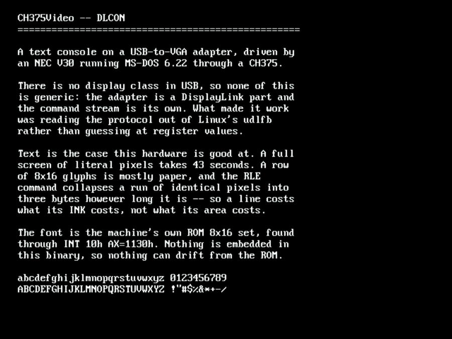
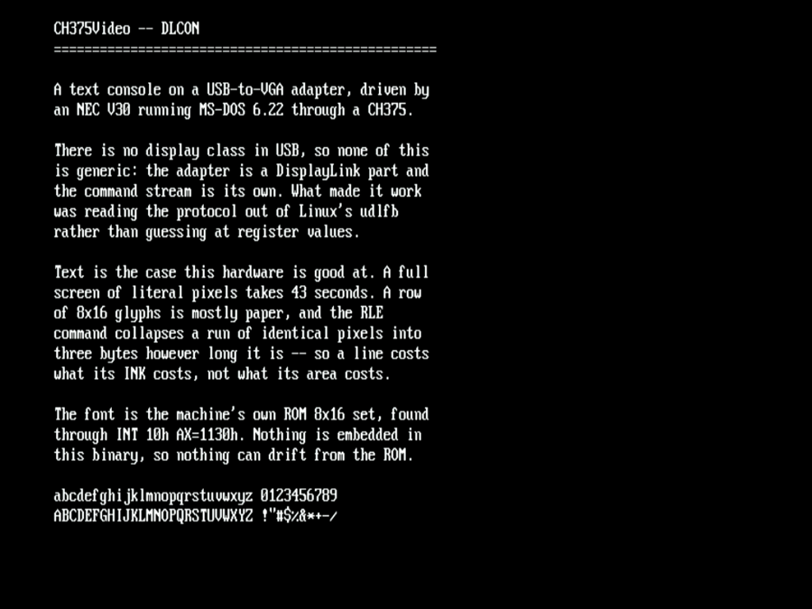
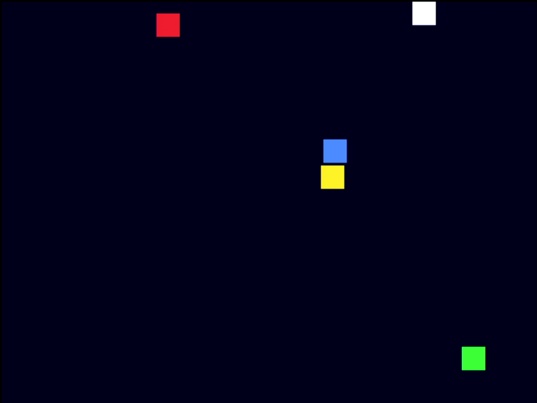
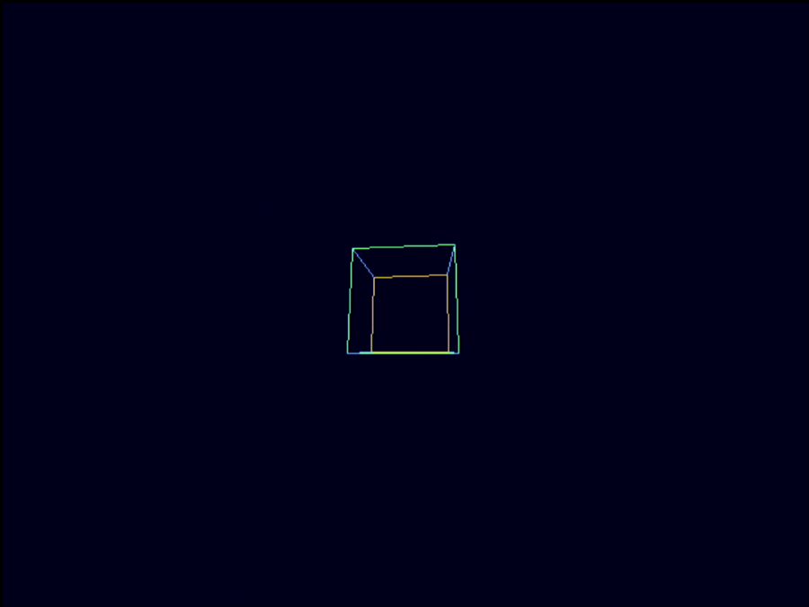

# CH375Video — USB display adapters over a CH375

An 8086 with a CH375 USB host card, driving a USB-to-VGA adapter.

**It works, and it moves.** A DisplayLink adapter is identified from its
own descriptors, a video mode is set, and pixels appear — a text console,
bouncing sprites, a rotating 3D wireframe cube, and 640×480 or 848×480
widescreen. Every picture below is a real photograph of the adapter's
output, taken through a capture card.



*80×30 characters at 640×480, drawn from the machine's own ROM 8×16 font.*

| tool | |
|---|---|
| `DLPROBE` | identify the adapter, decode its limits, read the monitor's EDID |
| `DLTEST` | draw test patterns and ask a human whether each appeared |
| `DLBENCH` | measure throughput, so optimisation is aimed rather than guessed |
| `DLDEMO` | moving graphics: balls, stars, a 3D cube, bars |
| `DLCON` | a text console, which is what this hardware is actually good at |

`build.cmd` builds all five. `build.cmd probe` runs `DLPROBE` on the DOS
box; `build.cmd read` runs it with `/K` so nothing is written at all.

## Why this is a different problem from CH375Net

CDC-ECM worked out because Ethernet **has a class**. The device describes
itself, so one bring-up covers adapters from vendors nobody here has
bought.

There is no USB display class. The Video class is for cameras. Every USB
display adapter is a private protocol, so there is nothing to generalise
over and no descriptor that says how to drive it. The only useful first
question is *which* private protocol, and that is what `DLPROBE` answers.

## The adapter

An **IOGEAR GUC2015V**, "USB 2.0 to VGA". Read off the device rather than
the box it came in:

```
17E9:0058   DisplayLink / "IOGEAR External VGA" / serial 009091
one configuration, one interface, class FF vendor-specific
  EP 01  OUT  bulk       max 64      <- commands and pixels
  EP 82  IN   interrupt  max 8
  descriptor type 5F, 30 bytes       <- the capability list
```

`17E9` is DisplayLink, and that is the whole identification — the product
ID varies per OEM and the strings are whatever the reseller asked for.

### Its two limits, and why the clock is the one that bites

The `5Fh` descriptor is a five-byte header then key/length/value triples.
It parses, and the triples **tile it exactly** — 30 bytes of 30, nothing
over. That check is the one that matters: a wrong guess at the layout
still yields plausible keys and values, and only insisting the walk land
on the final byte catches it.

```
key 0204  = 39999999   pixel-clock limit, Hz
key 0200  =  1500000   pixel-area limit
```

**Both bind, and the clock is the tighter one.** 1.5 million pixels of
area sounds like it allows 1024×768; the 40 MHz clock refuses it at 65.
That is the mistake a glance at the pixel count makes, and it makes it in
the optimistic direction.

The cap reads **39,999,999 Hz** — one hertz under a round 40 MHz, so
800×600@60 is reported MARGINAL rather than refused. (Truncating rather
than rounding also printed it as "39.9 MHz", which invites the same
error. It rounds now.)

**The hardware has since settled it.** 800×600@60 needs exactly
40,000,000 Hz — one hertz over the cap — and it drives this adapter
perfectly:


*800×600@60 at 40.0 MHz, one hertz over the advertised limit. Clean.*

So the cap really is a fencepost, and refusing the mode over one hertz
would have been confidently wrong. MARGINAL still stands as the verdict,
because one adapter agreeing is not every adapter agreeing and the honest
report is "try it".

### Widescreen

**720p is not reachable at any blanking** — 1280×720@60 needs 74.25 MHz
and even CVT reduced blanking wants 64. The clock cap decides it, not the
pixel count. **848×480@60 at 33.75 MHz is the 16:9 mode that fits**, and
it works:



*106×30 characters at 848×480 — the same console, native 16:9.*

A modern panel will usually letterbox or stretch 640×480 and 800×600
happily, so those stay the dependable choices; 848×480 is the one worth
trying for a native-aspect picture.

## The monitor, and why the intersection is the answer

`DLPROBE` reads the attached monitor's EDID **through** the adapter and
intersects it with the adapter's caps, because neither list is the answer
alone:

```
mode          dot clock   adapter                  monitor
640x480@60     25.2 MHz   ok                       yes   <--
640x480@75     31.5 MHz   ok                       yes   <--
720x400@70     28.3 MHz   ok                       yes   <--
848x480@60     33.8 MHz   ok                       (not listed)
800x600@60     40.0 MHz   MARGINAL -- but it WORKS  yes
1024x768@60    65.0 MHz   no -- clock              yes
1280x1024@60  108.0 MHz   no -- clock              yes
```

The bench monitor is a DELL 1708FP whose preferred mode is 1280×1024 at
108 MHz — nearly three times what this adapter will clock. Reading either
side alone gets the answer wrong.

## Speed: what was measured, and what it changed

`DLBENCH` exists because CH375Net has four dead optimisation hypotheses
written up, each of which measured as nothing. It reports **bytes/s
alongside the packet rate**, because a payload-bound path and a
transaction-bound path can report the same KB/s and want opposite fixes.

The first run said **72 packets/s in every test** — 13.9 ms for a 64-byte
packet, when a USB bulk transaction takes microseconds. So the time was
never on the wire. It was 64 iterations of `ch375`'s `WrDat`, each of
which is three nested procedure calls in a Large-model binary; `BENCH`
measures a procedure call on this machine at 46,501/s, so 64×3 is ~4 ms
before a byte reaches a port.

Inlining the packet write into one assembler block:

| | before | after |
|---|---|---|
| solid fill | 5,660 B/s, 72 pkt/s | **19,055 B/s, 291 pkt/s** |
| literal pixels | 5,350 B/s | **14,960 B/s** |
| text-like | 5,132 B/s | **13,267 B/s** |

**3–4× faster**, and USBPKT's hand-written assembly Ethernet path runs
2.9 ms/packet — so this is within 15% of it from portable Pascal.

### What was deliberately *not* done

**`REP OUTSB`.** It is an 80186 instruction this V30 has and a plain 8086
does not, so it needs a run-time gate with an 8086 fallback kept working
beside it. At 3.4 ms/packet the byte loop is now ~0.3 ms, so it is worth
about 6%. `CLAUDE.md`'s rule applies: do not write a gated fast path when
the gate costs more than the win buys. One path, runs everywhere, and it
will still be right on a 486.

**Coprocessor maths.** This machine has no x87 fitted, and it would not
help if it did: at 19 KB/s the geometry is free and the transfer is
everything. Everything here is integer fixed point with a 64-entry
quarter sine table.

## Moving graphics

A 640×480 16bpp framebuffer is 614,400 bytes and this machine has ~514 KB
of free heap, so **there is no back buffer**. The screen is write-only and
remote, and the only affordable way to animate is to touch what changed.

That is the whole design, and the numbers say why: a full solid screen is
0.66 s, a full screen of literal pixels is 43 s, and a 64×64 rectangle is
44 ms.



*Five sprites at **5.0 fps**, 2,944 bytes a frame — erase where it was,
draw where it is, touch nothing else.*



*A 3D wireframe cube at **1.7 fps**, 3,636 bytes a frame.*

The cube is the interesting one because it is the **only demo here that is
CPU-bound rather than transfer-bound**. It started at 0.4 fps with the
same bytes per frame, which is the signature: the transfer was not the
problem. Three fixes took it to 1.7 —

* clearing the render tile with `FillWord` (`REP STOSW`) instead of a
  Pascal loop: `CLAUDE.md` measures 439,821 words/s against 68,322 for a
  per-element store
* blitting straight out of the tile instead of copying each row into a
  staging buffer first — 61,952 needless far-pointer accesses a frame
* shrinking the tile from 176² to 112², which the cube never needed

| demo | fps | bytes/frame |
|---|---|---|
| stars (120 single pixels) | 5.8 | 2,240 |
| bars | 5.8 | 2,990 |
| balls (5 × 28² sprites) | 5.0 | 2,944 |
| cube (wireframe, CPU-bound) | 1.7 | 3,636 |


## Text, which is the case this hardware is good at

A row of 8×16 glyphs is mostly paper, and the RLE command collapses a run
of identical pixels into three bytes however long it is — so **a line
costs what its ink costs, not what its area costs**. A full 80×30 page is
85,376 bytes against 614,400 for the same area raw, and draws in 11.7 s.

The font is the machine's own ROM 8×16 set, found through `INT 10h
AX=1130h`. Nothing is embedded in the binary, so nothing can drift from
the ROM.

A whole page in 11.7 s is a page, not a terminal. The realistic use is
incremental: one changed line is about a twentieth of that.

## Traps, all of them paid for here

**Every transfer must be padded with `AF`.** The parser does not act on
the final command until more bytes follow it, so an unpadded transfer
silently drops its last command — 256 pixels, seen as a strip of the
*previous* picture surviving in the bottom-right corner. That reads as a
drawing bug or an address off-by-one and is neither: the addresses were
right and the fault was framing. `udlfb` does this with a `memset` that is
easy to read as housekeeping and skip. `DLTEST`'s **test 5** exists for
this failure alone — white over blue, asking only about that corner —
because folding it into "did you see white" hid it.

**Most timing registers take their value through a 16-bit LFSR.**
Registers `01`–`15` are `lfsr16(value)`; `0F` and `17` are plain
big-endian; `1B` is byte-swapped. Raw values give a dead screen and
nothing to diagnose. Taken from `udlfb`; going to that source instead of
trying register values is the decision that made any of this work.

**A picture landing off-centre is usually the monitor.** The first working
pattern sat ~100 px right of centre; the fix was the monitor's own
auto-adjust. `/X` and `/Y` can move the active region within the line
without changing either total or the dot clock, but they have **no
default** — compensating in software for one monitor's un-adjusted
position would have baked this bench into the tool.

**An animation that never erases is not fast, it is wrong.** The first
bars demo drew without erasing, and 203 frames piled into a striped mess
that looked deliberate enough in a screenshot to pass unnoticed. The
capture caught it.

**Polling an endpoint that never answers wedges the chip.** `WaitInt`
gives up; the chip does not. A program exiting then strands the token, and
the next tool reports **"no CH375 at 0260" on a card that is plainly
fitted**. It cost a power cycle. Everything here retires the token with
`ABORT_NAK` on exit and resets-and-re-asks before believing the slot is
empty, because `BusUp` gives up on a failed `CHECK_EXIST` before reaching
its own `ChipReset`.

**Bring-up resets the USB bus, which blanks the adapter.** So every tool
run starts with a dark screen until it sets a mode — which is why a
capture taken *during* a run's startup shows black, and one taken after a
run completes shows the last frame. The adapter holds its output between
runs.

**The retry policy is opposite for the two transfer types.** `8F` (retry
NAKs in hardware) is right for a control data stage and wrong for a data
endpoint, where a NAK is an *answer*. Absorbing it turned six honest NAKs
into six timeouts reported as "no interrupt".

**EDID is read two bytes at a time**, only the second byte being data, and
**all 128 bytes coming back zero is two findings** — the control path
works, and the adapter has nothing to describe. Nothing is decoded from a
zero block: 128 zeroes sum to zero, so it passes the EDID checksum
trivially.

**Git Bash mangles `/K` into a Windows path** before Python sees it, so
program flags passed through `dosctl run` from bash silently vanish. Every
tool here accepts `-K` as well; `cmd` and PowerShell pass either form.

## Next

1. **Only redraw what changed in text.** The console redraws a whole page;
   tracking dirty rows would make it a usable terminal.
2. **Derive timings from the EDID** rather than a built-in table, so any
   monitor's preferred mode is used when it fits inside both caps.
3. **`DLTEST` still carries its own timings table** from before `dl.pas`
   existed, so it has four modes where everything else has five, and it
   misses the inlined packet writer's 4×. It should use the unit.
4. **A 486 would change which half is the bottleneck.** The cube is
   CPU-bound here and everything else is transfer-bound; on a faster CPU
   the cube would join the others, and only then would `REP OUTSB` or a
   coprocessor be worth re-measuring.
